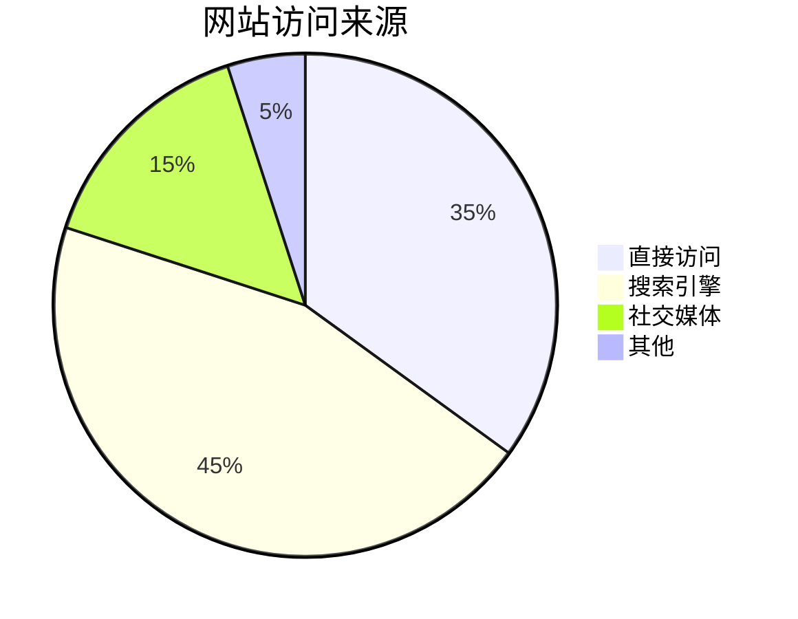

# 新功能

- 移除 `manifest v3` 的报错提示
- 增加性能优化版本的`vue2 devtools`

## 更新crx脚本

```
npm run crx

# 执行结果
更新： bhljhndlimiafopmmhjlgfpnnchjjbhd
(node:43821) ExperimentalWarning: Importing JSON modules is an experimental feature. This feature could change at any time
更新： bhljhndlimiafopmmhjlgfpnnchjjbhd 版本 0.4.1 to 0.4.1
更新： bmdblncegkenkacieihfhpjfppoconhi
更新： bmdblncegkenkacieihfhpjfppoconhi 版本 4.9.1 to 4.11.0
更新： fmkadmapgofadopljbjfkapdkoienihi
更新： fmkadmapgofadopljbjfkapdkoienihi 版本 4.27.3 to 5.0.0
更新： ienfalfjdbdpebioblfackkekamfmbnh
更新： ienfalfjdbdpebioblfackkekamfmbnh 版本 1.0.7 to 1.0.11
更新： jdkknkkbebbapilgoeccciglkfbmbnfm
更新： jdkknkkbebbapilgoeccciglkfbmbnfm 版本 4.1.4 to 4.8.0
更新： lmhkpmbekcpmknklioeibfkpmmfibljd
更新： lmhkpmbekcpmknklioeibfkpmmfibljd 版本 3.0.19 to 3.1.6
更新： nhdogjmejiglipccpnnnanhbledajbpd
更新： nhdogjmejiglipccpnnnanhbledajbpd 版本 6.5.0 to 6.6.1
更新：crx.json
更新完成
```

## 如何新增extension
  - 本地新增：不用vpn，修改`crx.json`，添加一个空数据，执行`npm run crx`
  - 非本地新增：需要能访问`Google`，直接`loadExtensionOptions`传递目标`extension`的`hash`

## 如何发布
```
npm run crx && npm publish
```

## 本地`link`开发
直接 `import` `index.ts` 

# 使用

```typescript
import { installExtension, VUE2_DEVTOOLS_EXTENDED } from "@kxxxl-front-end/electron-extension-installer";

app.on("ready", async () => {
  await installExtension(VUE2_DEVTOOLS_EXTENDED, {
    loadExtensionOptions: {
      allowFileAccess: true,
    },
    forceDownload: false, // 强制下载，不使用缓存
  });
});
```

# Electron Extension Installer

[](https://www.npmjs.com/package/electron-extension-installer) [](https://www.npmjs.com/package/electron-extension-installer)

# Introduction

This library is a modernized version of `electron-devtools-installer`. It is tested and works on up to electron v29. Min electron version is v11.

# Getting Started

```
npm i --save electron-extension-installer
```
